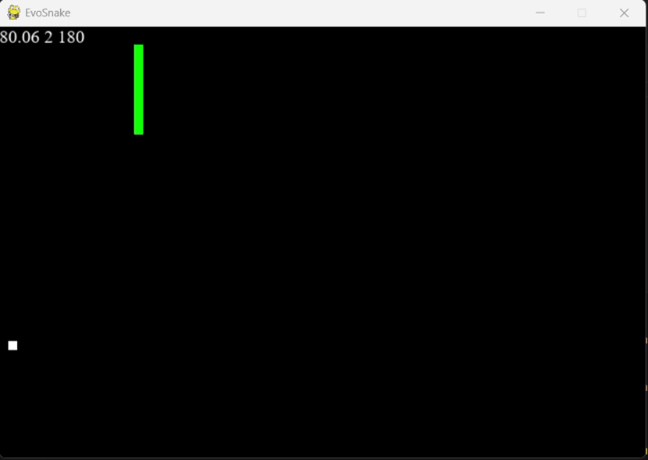
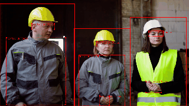
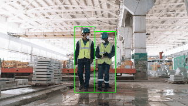

<h1 align="center">👋 Olá, eu sou o Augusto Sacramento Rodrigues</h1>
<h3 align="center">Cientista da Computação | Data Science | Inteligência Artificial | Visão Computacional</h3>

  
  
  

---

  <a href="#mim">🙋 Sobre mim</a> •
  <a href="#tecno">🛠️ Tecnologias</a> •
  <a href="#projetos">📂 Projetos</a> •
  <a href="#cursos">📚 Cursos</a> •
  <a href="#idiomas">🌐 Idiomas</a>

## 🙋 Sobre mim 

Meu nome é Augusto Sacramento Rodrigues e sou formado em Ciência da Computação pela Unicamp, onde tive a oportunidade de explorar diferentes áreas da computação, com foco especial em Inteligência Artificial, Visão Computacional, Machine Learning e Ciência de Dados. Durante a graduação, aprofundei meus conhecimentos em algoritmos, análise de dados, redes neurais, processamento de imagens e aprendizado estatístico, complementando a formação com cursos extracurriculares voltados à prática e aplicações reais.

Durante minha experiência como estagiário, desenvolvi soluções de IA aplicadas à visão computacional, como sistemas de busca forense e reconhecimento automático de placas veiculares (LPR). Também trabalhei na otimização de redes neurais e no desenvolvimento de pipelines de dados com técnicas de MLOps. Com experiência em ferramentas como Docker, SQL, Python e Power BI, colaborei em projetos que envolviam desde a coleta e o tratamento de dados até a geração de insights e entrega de modelos treinados em ambientes produtivos.

Sou movido por desafios, aprendizado contínuo e colaboração em equipe. Busco seguir evoluindo profissionalmente nas áreas de IA, ciência de dados e visão computacional, contribuindo com soluções tecnológicas que causem impacto positivo e inovação.

---

## 🛠️ Tecnologias

  
  
  
  
  
  
  
  
  
  

---

## 📂 Projetos

> Aqui estão alguns dos projetos que desenvolvi. Clique no nome para acessar o repositório completo.

---

### [🐍 EVoSnake](https://github.com/AugustoSRodrigues/EvoSnake)  
EvoSnake é um agente autônomo para o jogo da cobrinha (Snake) que utiliza Sistemas Classificadores - uma abordagem de aprendizado que combina regras de decisão    tipo "SE-ENTÃO" com algoritmos genéticos. O agente evolui através de gerações, onde regras competem entre si, são recompensadas ou punidas baseadas em seu desempenho, e se reproduzem para criar comportamentos cada vez mais eficientes no jogo

---
### [⛑️ EPI](https://github.com/AugustoSRodrigues/EPI-PPE)  

O projeto realiza a detecção automática do uso correto de Equipamentos de Proteção Individual (EPI) em imagens e vídeos, utilizando modelos de deep learning. Ele identifica itens como capacete, colete, óculos, luvas e botas em ambientes industriais ou de construção.

  
  

---

## 📚 Cursos e Formações 

- **Ciência da Computação - Universidade Estadual de Campinas** (2018-2024)

- **Técnico em Informática Integrado ao Ensino Médio - IFSP** (2013-2017)

- **Aprendizado de Máquina** (2021 - 60h)  
  Técnicas de aprendizado de máquina estatístico para classificação, agrupamento e detecção de outliers.  

- **Introdução ao Processamento de Imagem Digital** (2022 - 60h)  
  Transformações geométricas e radiométricas, filtragem no domínio espacial e no domínio da frequência, técnicas de restauração e introdução à segmentação.  

- **Applied Plotting, Charting & Data Representation in Python** (2023 - 25h)  
  Visualização com foco em relatórios e gráficos usando a biblioteca matplotlib.  

- **Residência TIC - IA (Unicamp)** (2023 - 40h)  
  Formação em inteligência artificial online pelo Instituto de Computação da Unicamp.  

- **Computação Evolutiva** (2023 - 60h)  
  Algoritmos genéticos e extensões, estratégias evolutivas, programação evolutiva, programação genética, sistemas classificadores, otimização multiobjetivo e dinâmica.  

- **Introduction to Data Science in Python** (2023 - 30h)  
  Introdução à manipulação e limpeza de dados e abstração de Series e DataFrame.  

- **Introdução à Inteligência Artificial** (2024 - 40h)  
  Fundamentos e aplicações de Inteligência Artificial, histórico e princípios de IA.  

- **Processamento e Análise de Imagens** (2024 - 60h)  
  Segmentação de imagens, transformações morfológicas, representação, descrição, extração de características, classificação supervisionada e não supervisionada.  

- **Redes Neurais** (2024 - 60h)  
  Redes neurais artificiais, arquiteturas básicas, estratégias e algoritmos de aprendizado.  

- **Formação Cientista de Dados: O Curso Completo** (2025 - 50h)  
  Modelagem preditiva com Deep Learning, redes neurais, séries temporais, regressão e técnicas de agrupamento.  
  Estatística inferencial, processamento de texto, análise de grafos, manipulação de dados com Python (NumPy, Pandas), SQL, MongoDB, Spark e AWS.  

- **Prompt Engineering Specialization** (2025 - 50h)  
  Prompt Engineering for ChatGPT, ChatGPT Advanced Data Analysis e Trustworthy Generative AI, com foco em criação de prompts, análise de dados e uso responsável da IA generativa.  
 

---

## 🌐 Idiomas | Languages

- Português: Nativo  
- Inglês: Intermediário  
- Espanhol: Básico  

---

Feito com 💻, ☕, curiosidade por IA, ciência de dados e visão computacional.

